# USGS Earthquake Data Pipeline Project

## Overview

This project demonstrates an end-to-end data engineering solution using the USGS Earthquake API to build a robust data pipeline. The primary focus is on leveraging the Medallion Architecture to efficiently process, transform, and analyze earthquake data. The project integrates Azure Data Factory for orchestrating data workflows and Microsoft Fabric for advanced data visualization and reporting.

## Key Components

### Medallion Architecture Implementation

The Medallion Architecture, consisting of Bronze, Silver, and Gold layers, is implemented to enhance data quality, streamline processing, and optimize performance.

- **Bronze Layer**:
  - Ingest raw earthquake data from the USGS Earthquake API.
  - Store the raw data in a data lake as a single source of truth.
  
- **Silver Layer**:
  - Transform and clean the raw data.
  - Apply necessary data transformations to make the data more refined and usable.
  
- **Gold Layer**:
  - Aggregate and optimize the transformed data.
  - Prepare the data for high-performance analytics and reporting.

### Data Engineering with Azure Data Factory

- **Data Ingestion**:
  - Use Azure Data Factory to orchestrate data ingestion from the USGS Earthquake API.
  - Schedule automated data extraction tasks to ensure up-to-date information.

- **Data Transformation**:
  - Implement data cleaning and transformation processes using Data Factory's data flows.
  - Ensure data consistency and accuracy across the pipeline.

- **Data Storage**:
  - Store data in Azure Data Lake Storage for scalable and secure data management.
  - Utilize Delta Lake for efficient data storage and versioning.

### Data Visualization with Microsoft Fabric

- **Data Analysis**:
  - Connect Microsoft Fabric to the Gold layer data.
  - Perform in-depth analysis of earthquake data, including trends, patterns, and anomalies.

- **Dashboard Creation**:
  - Design interactive dashboards in Microsoft Fabric to visualize earthquake occurrences, magnitudes, and other key metrics.
  - Provide users with actionable insights and comprehensive reports.

## Project Highlights

- **Enhanced Data Quality and Reliability**:
  - The Medallion Architecture ensures high data quality by systematically refining and optimizing data at each layer.
  
- **Scalable and Maintainable Pipelines**:
  - Azure Data Factory's orchestration capabilities simplify pipeline management and scalability.
  
- **High-Performance Analytics**:
  - The Gold layer provides a foundation for fast and efficient querying, enabling advanced analytics and reporting in Microsoft Fabric.

## Conclusion

This project showcases a comprehensive data engineering solution that integrates multiple Azure services and follows best practices in data architecture. By implementing the Medallion Architecture, we achieve a scalable, maintainable, and high-performing data pipeline that provides valuable insights into earthquake data.

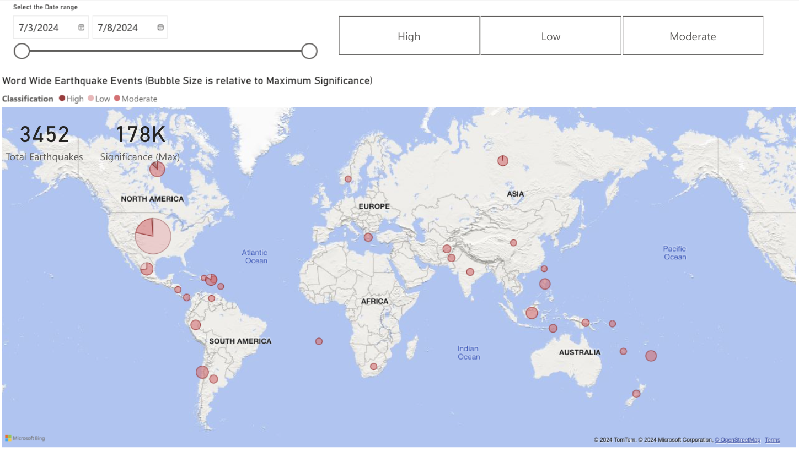
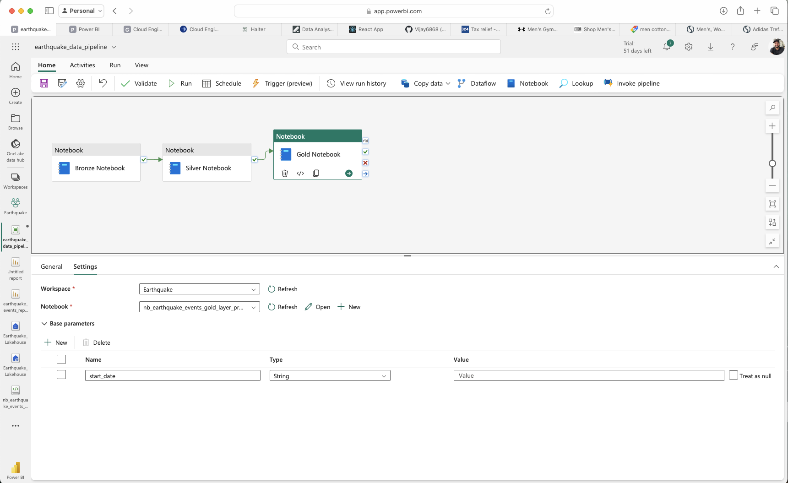
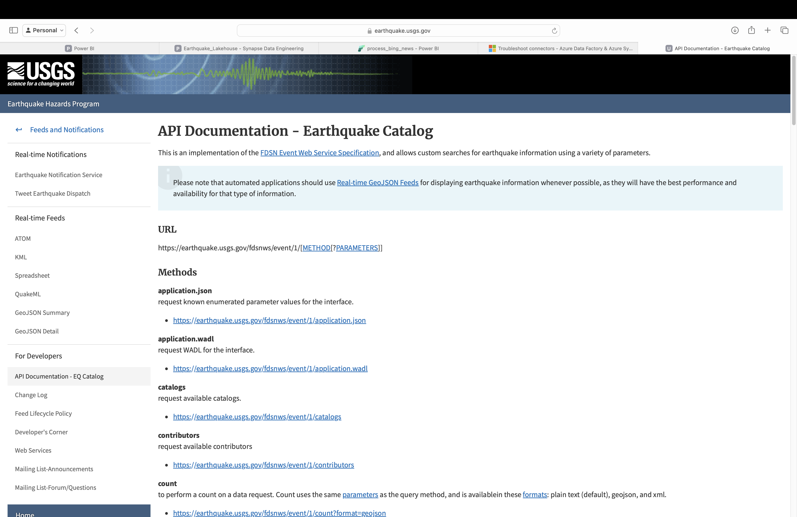
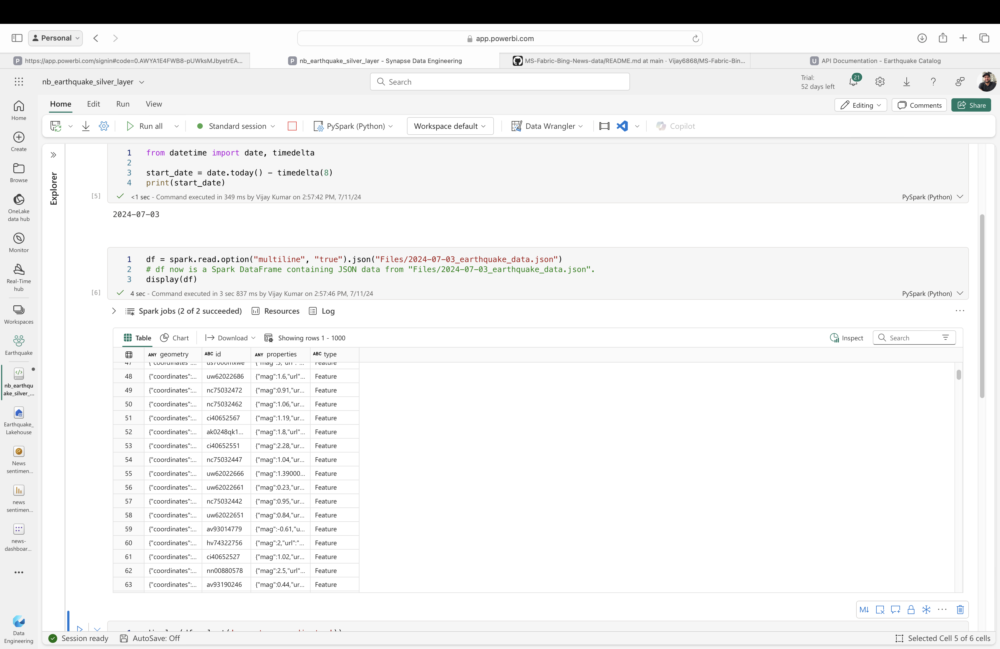
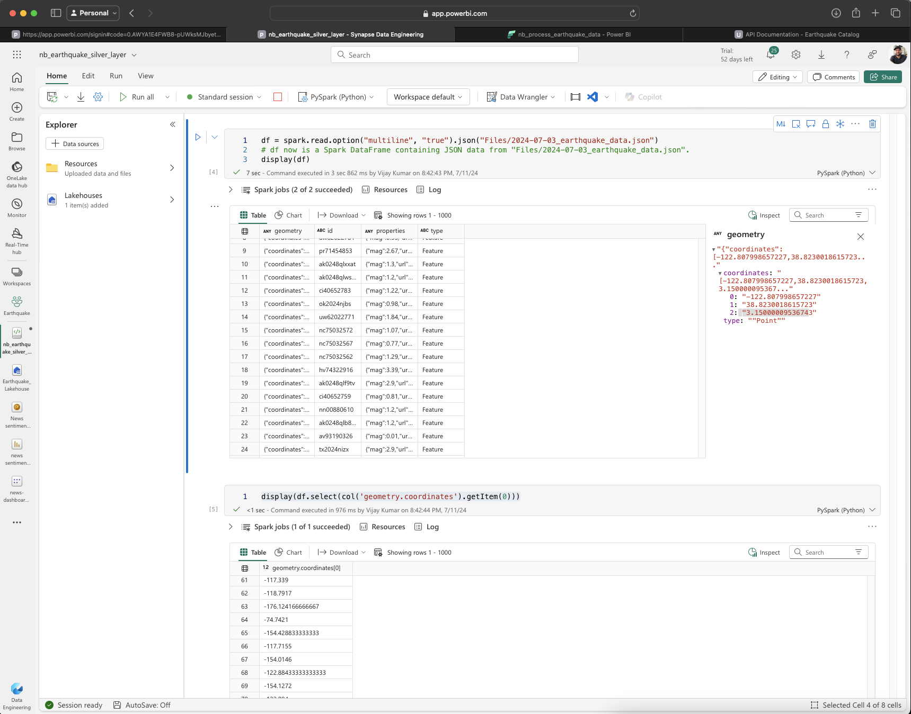
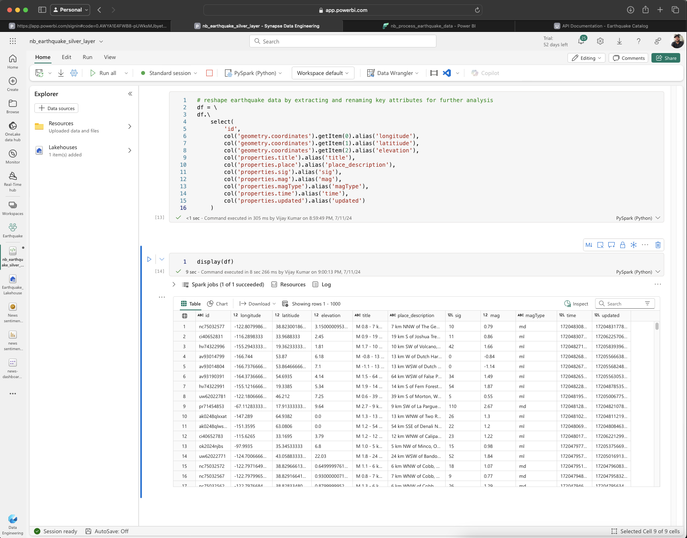
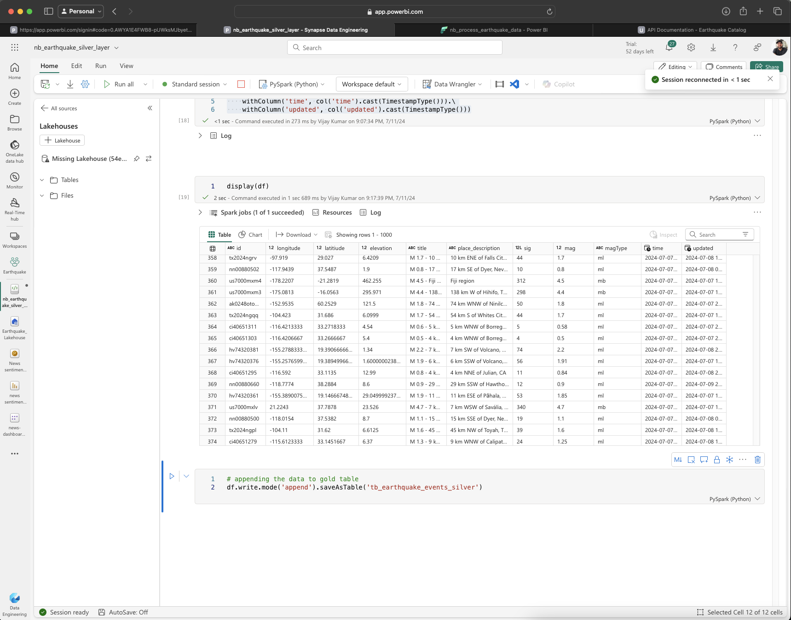
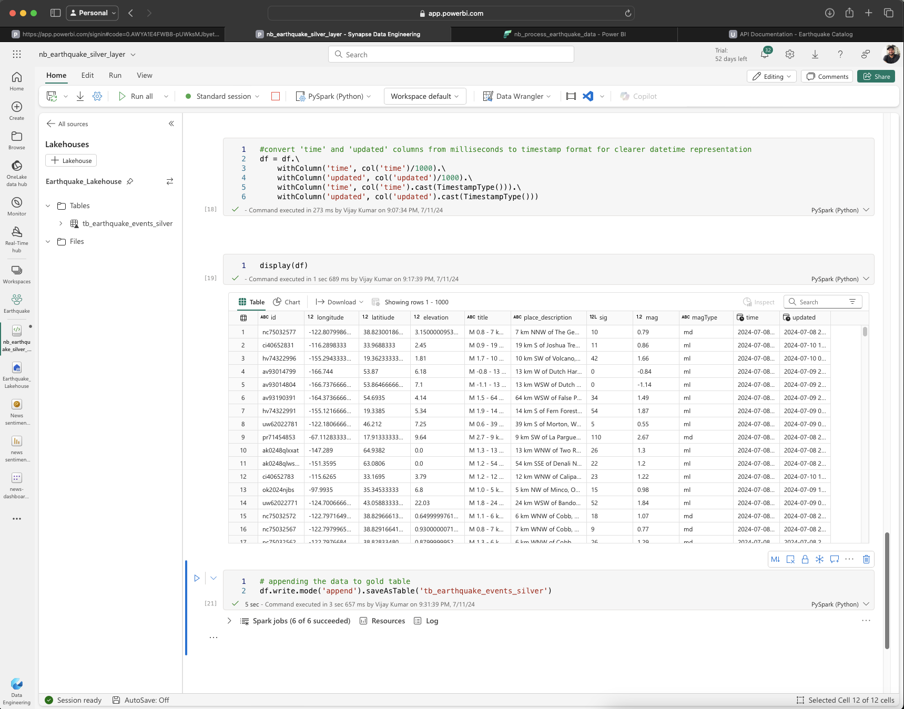
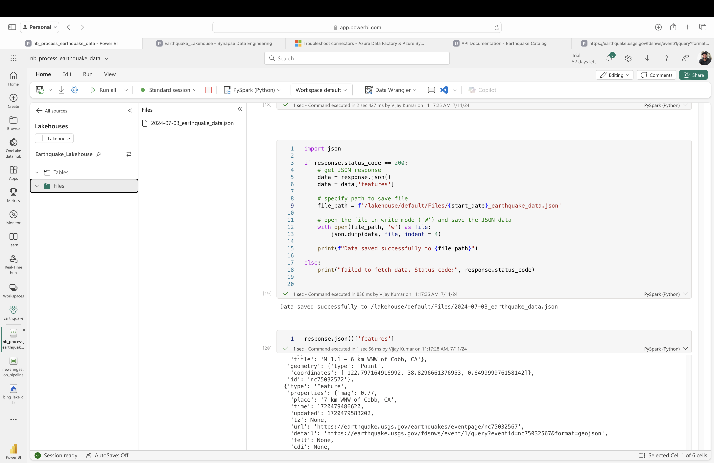
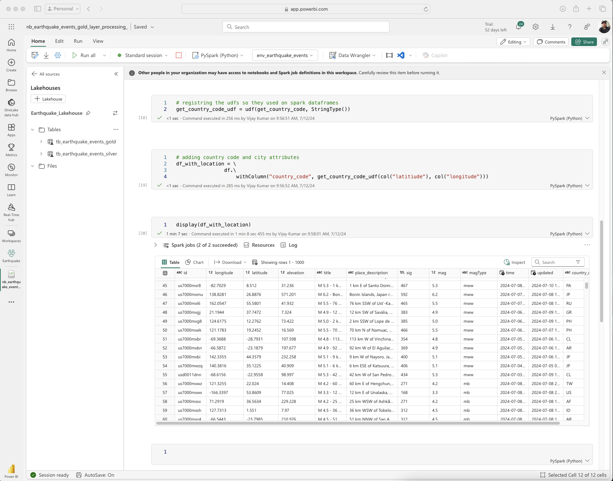
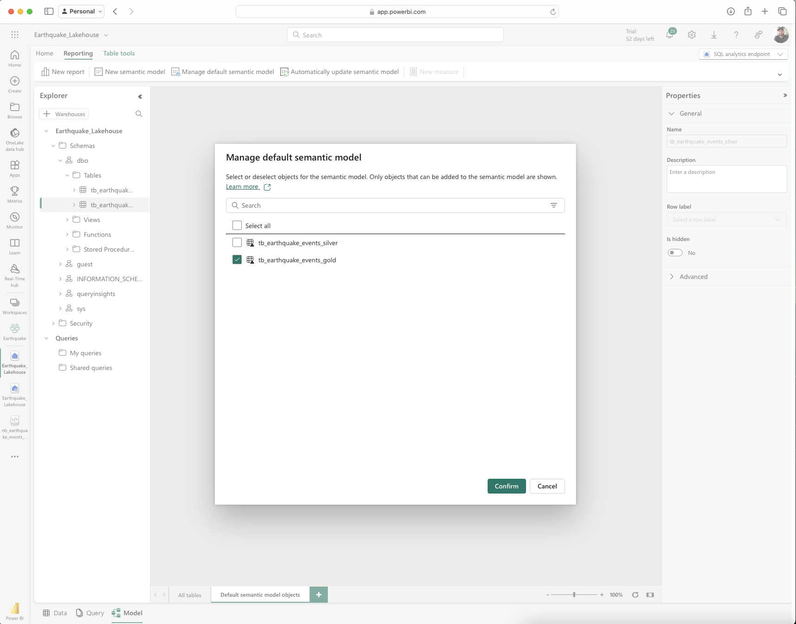
